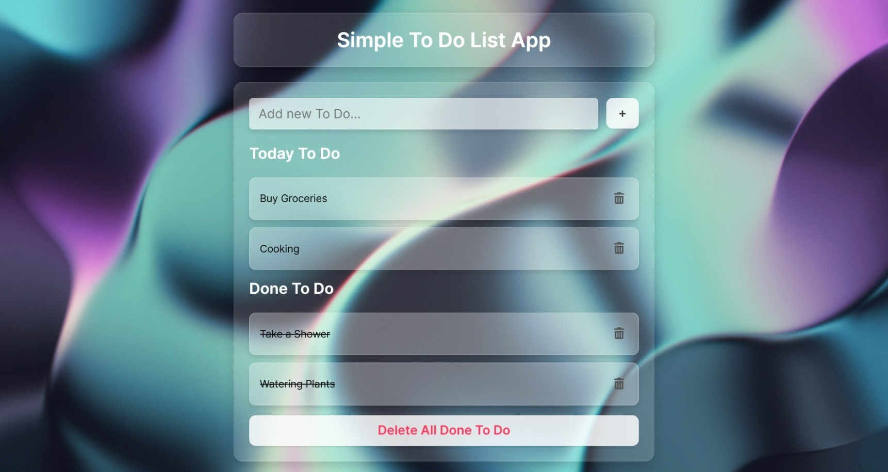
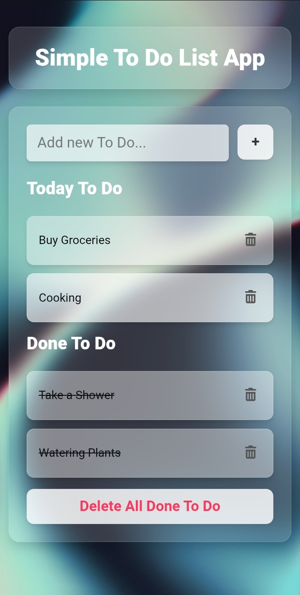

# Simple To-Do List App - Glassmorphism UI

<table align="center">
  <tr>
    <td align="center"><strong>Desktop View</strong></td>
    <td align="center"><strong>Mobile View</strong></td>
  </tr>
  <tr>
    <td></td>
    <td></td>
  </tr>
</table>

A fully responsive To-Do List web application built with a modern glassmorphism design. This project was developed as a hands-on exercise to master DOM manipulation concepts from **Colt Steele's Web Developer Bootcamp 2025** course on Udemy. The application leverages the **Bulma CSS framework** for its responsive layout, complemented by extensive custom CSS to achieve the unique visual effects.

[](https://fauzanharsya.github.io/glassmorphism-todo-app/)
---

## ✨ Features

- **Glassmorphism Design:** A beautiful, modern interface with layered, blurry backgrounds that create a sense of depth.
- **Full CRUD Functionality:** Users can **C**reate, **R**ead, **U**pdate (move between lists), and **D**elete to-do items.
- **State Persistence:** The application uses `localStorage` to save the user's to-do lists, ensuring that their data persists across browser sessions.
- **First-Load Experience:** To showcase functionality immediately, the app is populated with dummy data on the very first visit. Subsequent visits will load the user's saved data.
- **Interactive UI/UX:**
  - Clear visual feedback on interactive elements, such as hover effects on list items and buttons.
  - A distinct `:focus` state on the input field to guide the user.
- **Fully Responsive:** The layout, powered by Bulma's grid system, seamlessly adapts to all screen sizes.

---

## 🛠️ Tech Stack & Concepts Applied

This project combines the power of a CSS framework for structure with the flexibility of vanilla technologies for logic and custom aesthetics.

- **Vanilla HTML5:** For the core structure and semantics of the application.
- **Bulma CSS Framework:** Utilized for its elegant and mobile-first grid system to create a responsive layout with minimal effort.
- **Custom CSS3 Styling:** All unique visual elements were custom-coded, including:
  - **`backdrop-filter`** to achieve the glassmorphism effect.
  - **Custom Hover/Focus States** for interactive elements.
  - **Transitions** for smooth and subtle animations.
- **Vanilla JavaScript (ES6+):** For all application logic and interactivity, focusing on:
  - **DOM Manipulation:** Creating, appending, and removing elements dynamically.
  - **Event Handling & Delegation:** Efficiently managing user interactions (clicks, form submissions).
  - **`localStorage` API:** For client-side data storage and state management.
  - **Object & Array Manipulation:** Managing the to-do lists in memory.

---

## 🚀 Key Learning & Takeaways

Building this project was a fantastic learning experience. Some of the key challenges and learnings included:

- **Integrating a Framework with Custom Styles:** Learning how to use a framework like Bulma for its strengths (layout, grid) while overriding and extending it with custom CSS to achieve a unique, bespoke design.
- **State Management:** Developing a clear system for how data flows from the JavaScript arrays, to the DOM, and into `localStorage`.
- **Event Delegation:** Implementing a single event listener on the `body` to handle all clicks on dynamically created elements, a far more efficient approach than adding listeners individually.
- **UX Details:** Iteratively refining the UI, from deciding the optimal transparency levels for glassmorphism to creating intuitive hover and focus states that improve usability.

---

## ⚙️ How to Run Locally

To run this project on your local machine, simply follow these steps:

1.  **Clone the repository:**
    ```bash
    git clone https://github.com/fauzanharsya/glassmorphism-todo-app.git
    ```

2.  **Navigate to the project directory:**
    ```bash
    cd glassmorphism-todo-app
    ```

3.  **Open `index.html` in your browser:**
    You can do this by double-clicking the file in your file explorer or using a live server extension in your code editor (like Live Server for VS Code).

---

## 🙏 Credits & Acknowledgements

- **Background Image:** Photo by [István Kovács](https://unsplash.com/@pisti24?utm_content=creditCopyText&utm_medium=referral&utm_source=unsplash) on [Unsplash](https://unsplash.com/photos/a-close-up-of-a-blue-light-XkwVptYRaRU?utm_content=creditCopyText&utm_medium=referral&utm_source=unsplash).
- **Core Concepts:** The project is based on the curriculum of "The Web Developer Bootcamp 2025" by Colt Steele.
